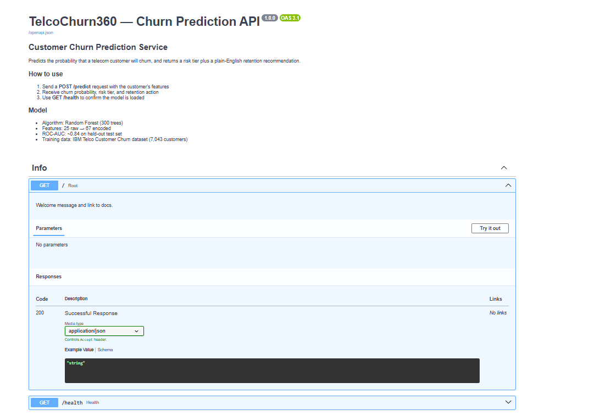
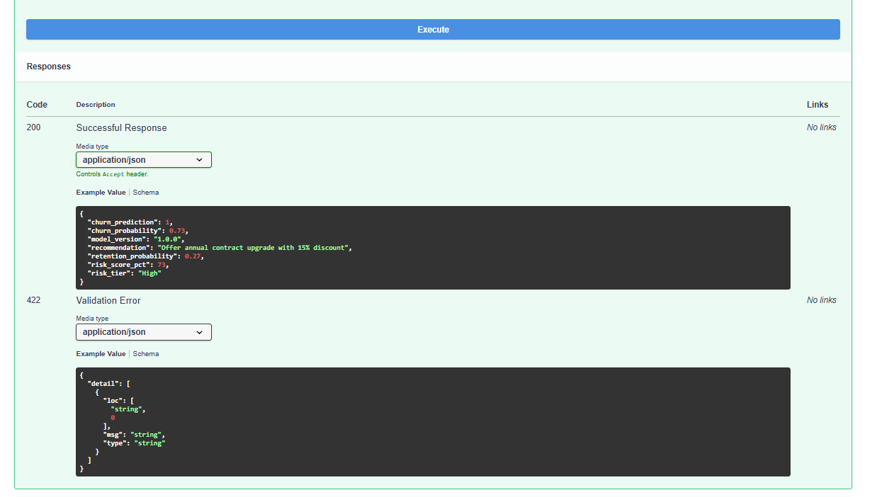
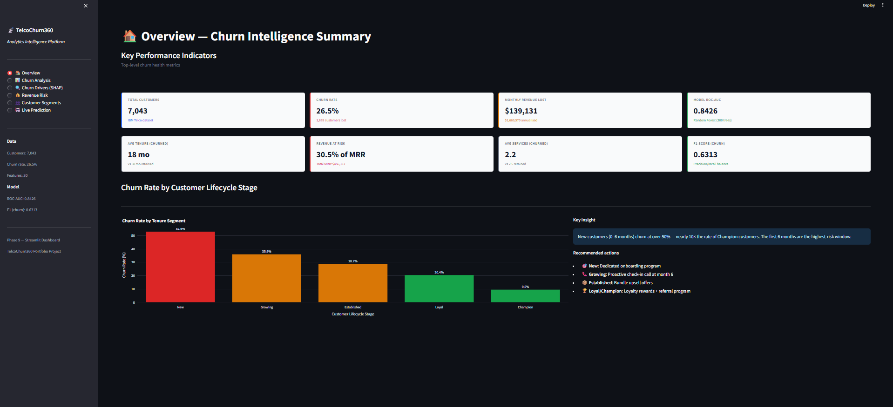
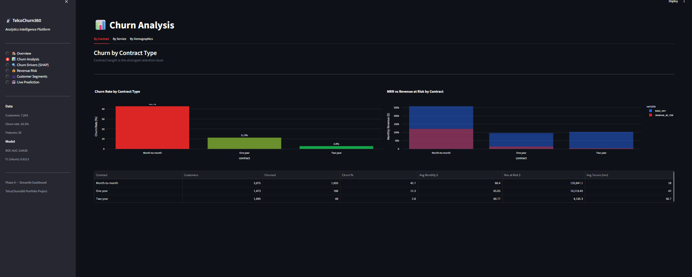
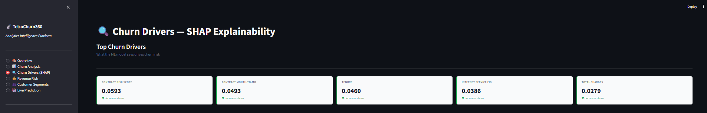
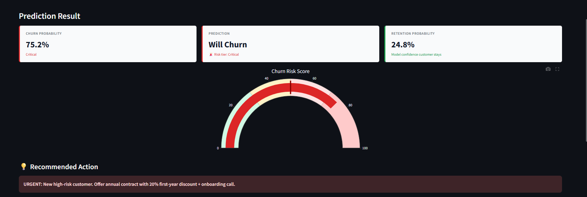

# TelcoChurn360
## End-to-End Customer Churn Intelligence Platform

> Analytics Engineering · SQL · Machine Learning · SHAP · FastAPI · dbt · Streamlit

---

## Project Summary

TelcoChurn360 is a production-style business intelligence platform built on the
IBM Telco Customer Churn dataset (7,043 customers). It combines analytics
engineering, SQL analysis, machine learning, and API deployment into a single
end-to-end system.

**Business problem:** A telecom company loses 26.5% of its customers annually.
Every churned customer represents lost monthly recurring revenue. This platform
identifies who will churn, why they will churn, and what retention action to take
— before it happens.

---

## Live Results (actual run)

| Metric | Value |
|---|---|
| Dataset | 7,043 customers · 21 raw features |
| Engineered features | 33 total (8 new business features) |
| Churn rate | 26.5% (1,869 churned) |
| Monthly revenue at risk | $139,131 |
| Annualised revenue at risk | $1,669,570 |
| Model | Random Forest (300 trees) |
| ROC-AUC (test set) | 0.8426 |
| ROC-AUC (5-fold CV mean) | 0.8451 |
| F1-score (churn class) | 0.63 |
| Pipeline runtime | 52 seconds end-to-end |

---

## Architecture
IBM Telco CSV (7,043 rows)
|
v
[Ingestion & Cleaning]        src/ingest.py · Pandas
Fix data types               8 engineered business features
Engineer features            Saves CSV + Parquet
|
+-----------> [SQL Analytics]        DuckDB
|               7 KPI queries         No server needed
|               $139k/mo at risk      7 output CSVs
|
+-----------> [dbt Models]            dbt-core + dbt-duckdb
|               stg_customers          18 data quality tests
|               mart_churn_kpis        3 mart tables
|               mart_customer_risk
|
+-----------> [ML Pipeline]           scikit-learn
StandardScaler +       RandomForest 300 trees
OneHotEncoder          ROC-AUC 0.8426
5-fold CV
|
v
[SHAP Explainability]   SHAP TreeExplainer
4 plots                plain-English insights
shap_insights.json
|
v
[FastAPI]               localhost:8000/docs
POST /predict          Swagger UI
POST /predict/batch    Pydantic validation
GET  /health
|
v
[Pipeline Runner]       src/run_pipeline.py
Orchestrates all       52 seconds total
steps in sequence      Quality gates
|
v
[Streamlit Dashboard]   localhost:8501
6 pages                Live prediction
KPI cards              SHAP plots
Revenue risk           Segments
---

## Key Business Insights

**1. Contract type is the #1 retention lever**

| Contract | Churn Rate | Avg Tenure |
|---|---|---|
| Month-to-month | 42.7% | 18 months |
| One year | 11.3% | 42 months |
| Two year | 2.8% | 57 months |

Migrating one month-to-month customer to an annual contract reduces their
churn probability by approximately 30 percentage points.

**2. New customers are the highest risk**

Customers in their first 6 months churn at 52.9% — nearly 6x the rate of
Champion customers (9.5%). Onboarding is the highest-leverage retention investment.

**3. Online security is the most protective service**

Customers with online security churn at 14.6% vs 31.3% without — a 16.7
percentage point reduction. Proactively offering security to at-risk customers
is measurably effective.

**4. Fiber optic customers are paradoxically high-risk**

Despite paying more, fiber customers have +27.4% churn lift compared to
non-fiber customers. Higher expectations and more competition means proactive
support is needed for this segment.

**5. SHAP top 5 churn drivers**

1. Tenure — short tenure is the strongest single predictor
2. Month-to-month contract — 3x churn risk vs two-year
3. Monthly charges — pricing sensitivity clusters above $70
4. Fiber optic internet — positive churn association
5. Total charges — higher lifetime value is protective

---

## Quick Start

```bash
# 1. Clone the repository
git clone https://github.com/YOUR_USERNAME/telcochurn360.git
cd telcochurn360

# 2. Create virtual environment
python -m venv venv

# Mac/Linux:
source venv/bin/activate
# Windows:
venv\Scripts\activate

# 3. Install dependencies
pip install -r requirements.txt

# 4. Download the dataset
# Go to: https://www.kaggle.com/datasets/blastchar/telco-customer-churn
# Place the CSV at: data/raw/WA_Fn-UseC_-Telco-Customer-Churn.csv

# 5. Run the full pipeline
# Mac/Linux:
python src/run_pipeline.py
# Windows:
set PYTHONPATH=%CD%
python src/run_pipeline.py

# 6. Launch the dashboard
streamlit run dashboard/app.py
# Opens at http://localhost:8501

# 7. Launch the API (separate terminal)
uvicorn api.main:app --reload --port 8000
# Swagger UI at http://localhost:8000/docs
```

---

## Project Structure
telcochurn360/
│
├── data/
│   ├── raw/                         # IBM Telco CSV (download from Kaggle)
│   └── processed/
│       ├── telco_cleaned.csv        # Phase 2 output
│       ├── telco_cleaned.parquet    # Fast format for DuckDB
│       └── sql_outputs/             # 7 SQL query result CSVs
│
├── sql/                             # Phase 3 — 7 analytical SQL queries
│   ├── churn_kpis.sql
│   ├── revenue_at_risk.sql
│   ├── churn_by_contract.sql
│   ├── churn_by_tenure.sql
│   ├── service_usage_analysis.sql
│   ├── customer_segmentation.sql
│   └── retention_analysis.sql
│
├── models/                          # Phase 4 — trained model artifacts
│   ├── churn_model.pkl              # Full sklearn Pipeline
│   ├── feature_meta.pkl             # Feature column names
│   ├── model_metrics.json           # ROC-AUC, F1, confusion matrix
│   └── plots/                       # ROC curve, confusion matrix, importances
│
├── shap_outputs/                    # Phase 5 — SHAP explanations
│   ├── shap_summary.png
│   ├── shap_bar.png
│   ├── shap_waterfall.png
│   ├── shap_dependence_tenure.png
│   └── shap_insights.json
│
├── dbt_churn/                       # Phase 6 — dbt project
│   ├── dbt_project.yml
│   └── models/
│       ├── staging/
│       │   ├── stg_customers.sql
│       │   ├── _sources.yml
│       │   └── _stg_customers.yml
│       └── marts/
│           ├── mart_churn_kpis.sql
│           ├── mart_churn_by_segment.sql
│           ├── mart_customer_risk.sql
│           └── _marts.yml
│
├── api/                             # Phase 7 — FastAPI service
│   ├── schemas.py                   # Pydantic request/response models
│   ├── model_loader.py              # Model loading + business logic
│   └── main.py                      # 4 endpoints + CORS + timing
│
├── dashboard/                       # Phase 9 — Streamlit dashboard
│   └── app.py                       # 6-page interactive dashboard
│
├── src/                             # Pipeline modules
│   ├── ingest.py                    # Phase 2: ingestion + cleaning
│   ├── run_sql_analytics.py         # Phase 3: DuckDB runner
│   ├── train.py                     # Phase 4: ML training
│   ├── explain.py                   # Phase 5: SHAP
│   ├── run_dbt.py                   # Phase 6: dbt runner
│   └── run_pipeline.py              # Full pipeline orchestrator
│
├── screenshots/                     # Portfolio screenshots
│   ├── api/                         # Swagger UI, prediction responses
│   └── dashboard/                   # All 6 dashboard pages
│
├── test_api.py                      # API test suite (5 tests)
├── check_project.py                 # Project health check
├── requirements.txt
└── README.md
---

## Tech Stack

| Layer | Technology | Version |
|---|---|---|
| Language | Python | 3.11 |
| Data manipulation | Pandas | 2.2 |
| Database | DuckDB | 0.10 |
| Analytics engineering | dbt-core + dbt-duckdb | 1.8 |
| ML framework | scikit-learn | 1.5 |
| Explainability | SHAP | 0.45 |
| API framework | FastAPI + Uvicorn | 0.111 |
| Request validation | Pydantic | 2.7 |
| Pipeline orchestration | Custom runner (src/run_pipeline.py) | — |
| Dashboard | Streamlit + Plotly | 1.35 |

---

## API Reference

Base URL: `http://localhost:8000`

| Method | Endpoint | Description |
|---|---|---|
| GET | `/` | Service info and links |
| GET | `/health` | Model status and metadata |
| POST | `/predict` | Predict churn for one customer |
| POST | `/predict/batch` | Predict for up to 500 customers |
| GET | `/docs` | Swagger UI — interactive testing |

**Example request:**
```bash
curl -X POST http://localhost:8000/predict \
  -H "Content-Type: application/json" \
  -d '{"tenure": 3, "contract": "Month-to-month", ...}'
```

**Example response:**
```json
{
  "churn_prediction": 1,
  "churn_probability": 0.73,
  "retention_probability": 0.27,
  "risk_tier": "High",
  "risk_score_pct": 73.0,
  "recommendation": "Offer annual contract upgrade with 15% discount",
  "model_version": "1.0.0"
}
```

---

## Screenshots

### API — Swagger UI


### API — Prediction Response


### Dashboard — Overview KPIs


### Dashboard — Churn Analysis


### Dashboard — SHAP Churn Drivers


### Dashboard — Live Prediction


---

## Technical Design Decisions

**DuckDB over PostgreSQL** — Zero server setup. Queries parquet files directly.
Eliminates infrastructure complexity while demonstrating identical SQL skills.
Production equivalent: BigQuery, Snowflake, or Redshift.

**Random Forest over XGBoost** — Correct first model choice. Robust, needs
minimal tuning, integrates cleanly with SHAP. XGBoost is the documented next
step to improve AUC further.

**sklearn Pipeline** — Prevents data leakage. The scaler and encoder are fitted
only on training data. Single .pkl file contains complete inference logic.

**dbt over raw SQL** — Adds dependency resolution, built-in data quality tests,
and auto-generated lineage. Every transformation is reviewable, testable,
version-controlled SQL.

**SHAP over feature importances** — Per-customer attribution, not just averages.
Makes the model actionable — a retention team can see exactly why a specific
customer is flagged as high risk.

**Custom pipeline runner over Airflow** — Airflow does not support Windows
natively. The custom runner in src/run_pipeline.py mirrors the Airflow DAG
logic exactly: sequential task execution, quality gates (ROC-AUC >= 0.75),
validation checks, and run logging. The Airflow DAG (dags/churn_pipeline_dag.py)
is included and runs correctly on Linux/Mac or WSL2.

---

## Interview Positioning

**Data Analyst** — 7 SQL queries, KPI design, revenue risk quantification,
business insight translation, Streamlit dashboarding

**Product Analyst** — Customer segmentation, lifecycle analysis, retention
analysis, A/B thinking, plain-English business recommendations

**Analytics Engineer** — dbt models (staging + marts), 18 data quality tests,
lineage documentation, DuckDB + Parquet

**Data Scientist** — Full ML pipeline, class imbalance handling, cross-validation,
SHAP explainability, model evaluation metrics

**Data Engineer** — ETL pipeline design, FastAPI deployment, Parquet/DuckDB,
pipeline orchestration with quality gates

---

## Dataset Credit

IBM Telco Customer Churn via Kaggle:
https://www.kaggle.com/datasets/blastchar/telco-customer-churn

---

## License

MIT License — free for learning and portfolio use.